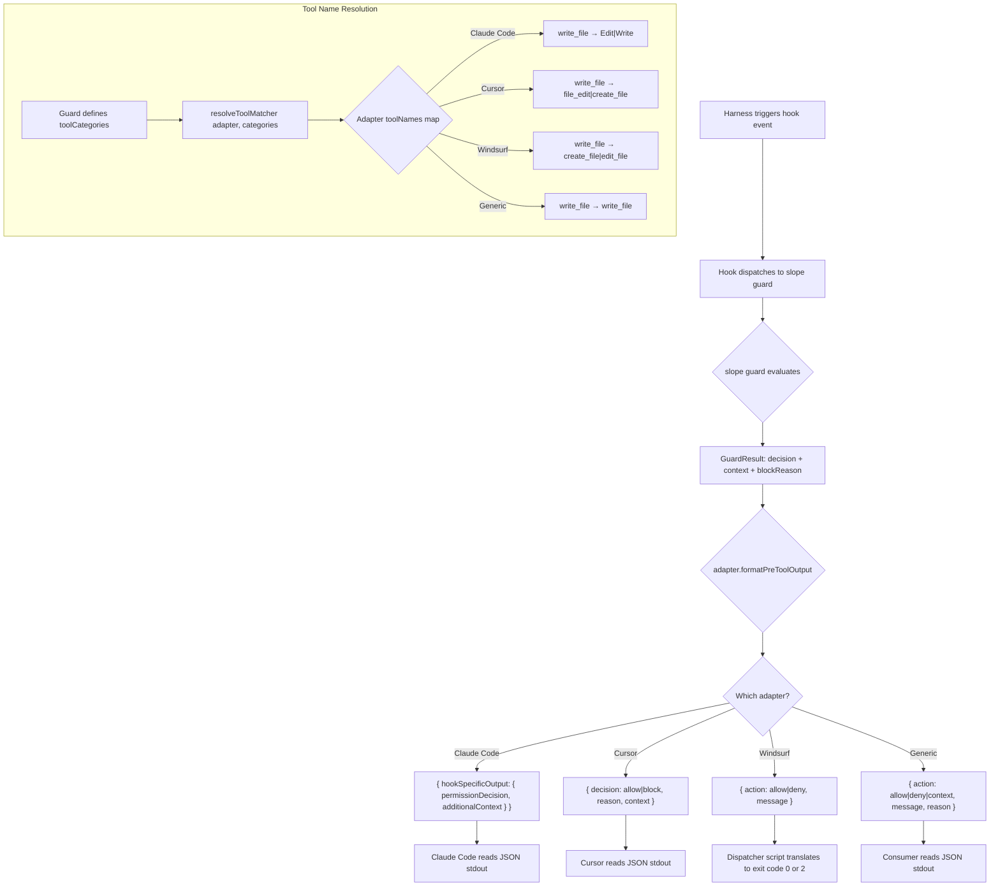

# Harness Hook Research — AI Coding Tool Compatibility

> Sprint 35 research: documenting hook systems across AI coding harnesses for SLOPE guard integration.

## 1. Overview — Compatibility Matrix

| Feature | Claude Code | Cursor | Cline | Windsurf | OpenCode | Continue | Generic |
|---------|------------|--------|-------|----------|----------|----------|---------|
| PreToolUse | ✓ | ✓ | ✓ | ✓ (exit code) | ✗ | ✗ | ✓ (JSON) |
| PostToolUse | ✓ | ✓ | ✓ | ✓ | ✗ | ✗ | ✓ |
| Stop | ✓ | ✓ | ✓ (TaskCancel) | ✗ | ✗ | ✗ | ✓ |
| PreCompact | ✓ | ✗ | ✓ | ✗ | ✗ | ✗ | ✓ |
| Context injection | ✓ | ✓ | ✓ | ✗ | ✗ | ✗ | ✓ |
| Block/deny | ✓ | ✓ | ✓ | ✓ | ✗ | ✗ | ✓ |
| Ask decision | ✓ | ✗ | ✗ | ✗ | ✗ | ✗ | ✓ |
| Session events | ✓ | ✓ | ✓ (8 events) | ✓ | ✓ (plugin) | ✗ | ✗ |

**Legend:** ✓ = fully supported, ✗ = not available, (exit code) = supported via exit-code protocol rather than JSON output.

**OpenCode note:** Has a plugin system (`.opencode/plugins/`) with session lifecycle events (`session.created`, `session.idle`, `session.deleted`, `session.compacted`) but no tool-level hooks. SLOPE already generates a session plugin via `slope init --opencode`. Guards use `GenericAdapter`. No dedicated adapter needed.

## 2. Cursor

**Feasibility: Full adapter** — Cursor has a comprehensive hooks system with 18+ lifecycle events, JSON stdin/stdout protocol, and the ability to block, modify, or inject context.

### Hook System

Cursor (v1.7+) supports lifecycle hooks configured in `.cursor/hooks.json`. Hooks receive JSON on stdin and return JSON on stdout.

**Source:** [Cursor Hooks Documentation](https://docs.cursor.com/configuration/hooks) *(verify URL against current Cursor docs)*

### Config Schema — `.cursor/hooks.json`

```json
{
  "hooks": [
    {
      "event": "pre-tool-use",
      "matcher": "file_edit|create_file",
      "command": ".cursor/hooks/slope-guard.sh guard-name",
      "timeout": 10000,
      "description": "SLOPE guard: description"
    },
    {
      "event": "post-tool-use",
      "matcher": "run_terminal_command",
      "command": ".cursor/hooks/slope-guard.sh guard-name",
      "timeout": 10000,
      "description": "SLOPE guard: description"
    }
  ]
}
```

**Hook events:** `pre-tool-use`, `post-tool-use`, `on-stop`

### Tool Name Mappings → ToolCategory

| ToolCategory | Cursor Tool Name(s) |
|-------------|-------------------|
| `read_file` | `read_file` |
| `write_file` | `file_edit\|create_file` |
| `search_files` | `list_directory` |
| `search_content` | `grep_search` |
| `execute_command` | `run_terminal_command` |
| `create_subagent` | `create_subagent` |
| `exit_plan` | `exit_plan` |

### Hook Protocol

**Input (JSON on stdin):**
```json
{
  "event": "pre-tool-use",
  "tool_name": "file_edit",
  "tool_input": { "file_path": "src/index.ts", "content": "..." },
  "cwd": "/project"
}
```

**Output (JSON on stdout):**
```json
{
  "decision": "allow",
  "reason": "Guard passed",
  "context": "Additional context for the agent"
}
```

Decision values: `"allow"` (proceed), `"block"` (deny execution), `"modify"` (alter tool input).

### Limitations
- No `"ask"` decision — Cursor doesn't support prompting the user for confirmation
- `"modify"` decision allows tool input changes (SLOPE doesn't use this currently)

## 3. Windsurf

**Feasibility: Partial adapter** — Windsurf's Cascade hooks support pre/post events with exit-code-based blocking but no context injection.

### Hook System

Windsurf uses Cascade hooks — shell commands that run before/after tool execution. Pre-hooks can block via exit code 2. No JSON output protocol; the harness reads only the exit code.

**Source:** [Windsurf Cascade Documentation](https://docs.windsurf.com/cascade/hooks) *(verify URL against current Windsurf docs)*

### Config Schema

Windsurf hooks are configured in `.windsurf/hooks.json`:

```json
{
  "hooks": [
    {
      "event": "pre-tool-use",
      "matcher": "edit_file|create_file",
      "command": ".windsurf/hooks/slope-guard.sh guard-name",
      "timeout": 10000,
      "description": "SLOPE guard: description"
    }
  ]
}
```

### Tool Name Mappings → ToolCategory

| ToolCategory | Windsurf Tool Name(s) |
|-------------|---------------------|
| `read_file` | `read_file` |
| `write_file` | `create_file\|edit_file` |
| `search_files` | `find_files` |
| `search_content` | `search` |
| `execute_command` | `run_command` |
| `create_subagent` | `create_subagent` |
| `exit_plan` | `exit_plan` |

### Exit-Code Protocol

Windsurf reads the process exit code to determine the hook's decision:
- **Exit 0** — Allow (tool proceeds)
- **Exit 2** — Block (tool execution denied)
- **Any other exit** — Error (logged, tool proceeds)

The SLOPE dispatcher script (`.windsurf/hooks/slope-guard.sh`) wraps `slope guard`, reads the JSON stdout, and translates `action: "deny"` to exit code 2. The adapter itself stays JSON-in/JSON-out like all others.

### Limitations
- **No context injection** — Can block but can't add `additionalContext` to the agent's context
- **No `on-stop` event** — Can't guard session termination
- **No `"ask"` decision** — No user confirmation prompt
- **Exit-code only** — Stdout from hooks is not consumed by the harness

## 4. OpenCode

**Feasibility: Generic adapter only** — No dedicated adapter needed for guards.

### Plugin System

OpenCode uses a plugin system in `.opencode/plugins/` with session-level lifecycle events:
- `session.created` — New session started
- `session.idle` — Session idle
- `session.deleted` — Session deleted
- `session.compacted` — Context compacted

**Source:** [OpenCode Plugin Documentation](https://opencode.ai/docs/plugins) *(verify URL against current OpenCode docs)*

### Why No Dedicated Adapter

OpenCode has **no tool-level hooks** — plugins can't intercept tool calls, block execution, or inject guard context. The session events are useful for SLOPE session tracking (start/end/compact) but not for guard integration.

SLOPE already generates an OpenCode session plugin via `slope init --opencode`, which covers lifecycle tracking. For guard functionality, OpenCode users should use the `GenericAdapter` with manual hook integration.

### Coverage

| Feature | Coverage |
|---------|----------|
| Session lifecycle | ✓ via `slope init --opencode` plugin |
| Guard hooks | ✗ — use GenericAdapter |
| Context injection | ✗ |
| Tool blocking | ✗ |

## 5. Cline

**Feasibility: Full adapter** — Cline (v3.36+) has a comprehensive hook system with 8 lifecycle events, JSON stdin/stdout protocol, and the ability to block, modify, or inject context.

**Source:** [Cline Hooks Documentation](https://docs.cline.bot/features/hooks), [Cline v3.36 Blog Post](https://cline.bot/blog/cline-v3-36-hooks), [Cline GitHub](https://github.com/cline/cline) (v3.68.0, 2026-02-27)

### Hook System

Cline supports **8 hook events**, defined in `src/core/hooks/hook-factory.ts` as the `Hooks` interface:

| Event | Trigger | SLOPE Mapping |
|---|---|---|
| **PreToolUse** | Before tool execution | `PreToolUse` |
| **PostToolUse** | After tool execution (even on error) | `PostToolUse` |
| **TaskCancel** | User cancels running task | `Stop` |
| **PreCompact** | Before conversation history truncation | `PreCompact` |
| **UserPromptSubmit** | User sends a message | — (no SLOPE equivalent) |
| **TaskStart** | New task initiated | — (session tracking only) |
| **TaskResume** | Interrupted task resumed | — (session tracking only) |
| **TaskComplete** | Task finishes successfully | — (not mapped to Stop — see note) |

**Note:** `TaskComplete` is intentionally NOT mapped to SLOPE's `Stop` event. A completed task can't be blocked — it already finished. Only `TaskCancel` maps to `Stop` because cancellation can be intercepted.

### Hook Discovery Model — Per-Event Scripts (git-style)

Cline uses per-event script discovery, identical to git hooks. Each hook event maps to a **single executable file** named exactly after the event:

```
.clinerules/hooks/PreToolUse     (executable, no extension)
.clinerules/hooks/PostToolUse
.clinerules/hooks/TaskCancel
.clinerules/hooks/PreCompact
```

Two directories are scanned (both optional):
1. **Global:** `~/Documents/Cline/Rules/Hooks/`
2. **Workspace:** `.clinerules/hooks/` in each workspace root

Global hooks execute first, then workspace hooks. If either returns `cancel: true`, the operation stops.

**Source:** `src/core/hooks/hook-factory.ts` (`findHookInHooksDir`, `findUnixHook`), `src/core/storage/disk.ts` (`getAllHooksDirs`)

### Hook Protocol

**Input (JSON on stdin):**
```json
{
  "preToolUse": {
    "tool": "write_to_file",
    "parameters": { "path": "src/index.ts", "content": "..." }
  },
  "taskId": "abc123",
  "clineVersion": "3.68.0",
  "hookName": "PreToolUse",
  "timestamp": "2026-02-27T12:00:00.000Z",
  "workspaceRoots": ["/project"],
  "userId": "user-id"
}
```

**Output (JSON on stdout):**
```json
{
  "cancel": true,
  "errorMessage": "SLOPE guard: file is in a restricted area",
  "contextModification": "Additional context injected into the agent's live context"
}
```

- `cancel: boolean` — `true` blocks execution. For PreToolUse, prevents tool from running. For PostToolUse, cancels the task (tool already executed).
- `contextModification: string` — injected into agent context. Truncated to 50KB (`MAX_CONTEXT_MODIFICATION_SIZE`).
- `errorMessage: string` — user-visible denial message when `cancel: true`.
- Hooks are **fail-open**: script errors (non-zero exit without valid JSON) allow execution to proceed.

**Source:** `src/core/hooks/hook-factory.ts` (`validateHookOutput`), `src/core/hooks/PreToolUseHookCancellationError.ts`

### Tool Name Mappings → ToolCategory

Verified from Cline v3.68.0 system prompt and source:

| ToolCategory | Cline Tool Name(s) |
|-------------|-------------------|
| `read_file` | `read_file` |
| `write_file` | `write_to_file\|replace_in_file` |
| `search_files` | `list_files` |
| `search_content` | `search_files` |
| `execute_command` | `execute_command` |
| `create_subagent` | `use_mcp_tool` |
| `exit_plan` | `plan_mode_response` |

**Caution:** Cline's `search_files` is a **content search** (regex grep), NOT file listing. `list_files` is file/directory listing. This is the opposite of what you might guess from the names.

### MCP Configuration

MCP settings are stored in VS Code's extension storage directory: `cline_mcp_settings.json`. The path is resolved at runtime by `getMcpSettingsFilePath()` in `src/core/storage/disk.ts`. This is NOT a workspace-level file — it lives in VS Code's global storage.

```json
{
  "mcpServers": {
    "slope": {
      "command": "npx",
      "args": ["-y", "mcp-slope-tools"],
      "alwaysAllow": [],
      "disabled": false
    }
  }
}
```

### Limitations

- **One script per event** — no matcher-based routing. The SLOPE dispatcher script must handle all tool filtering internally.
- **macOS/Linux only** — Windows hook execution is disabled in Cline source.
- **No `"ask"` decision** — Cline has no user-confirmation prompt. `ask` maps to `cancel: false`.
- **Per-event scripts mean no config file** — `hooksConfigPath` returns `null` (directory-based discovery, not a config file).

### SLOPE Adapter Strategy

- **Adapter type:** Full `ClineAdapter`
- **Detection:** `.clinerules/hooks/` directory (stricter than just `.clinerules/` to avoid false-positives)
- **Install model:** Write per-event dispatcher scripts to `.clinerules/hooks/PreToolUse`, `PostToolUse`, `TaskCancel`, `PreCompact`
- **Each script:** Reads JSON stdin, extracts tool name, calls `slope guard <guard-name>`, returns `{ cancel, contextModification, errorMessage }`

## 6. Continue

**Feasibility: Generic adapter only** — Continue has no tool-level hook system. MCP support + rules provide partial integration.

**Source:** [Continue GitHub](https://github.com/continuedev/continue), [Continue Docs](https://docs.continue.dev)

### No Hook System

Continue has NO mechanism to intercept tool calls. Verified by searching the entire codebase — no `beforeToolCall`, `afterToolCall`, `toolHook`, or event listener patterns for tool execution exist. The closest mechanisms are internal-only:
- `preprocessArgs` — transforms arguments before execution (per-tool-definition, not configurable)
- `evaluateToolCallPolicy` — permission level determination (internal)

### MCP Support

Continue supports MCP servers in Agent mode. Configuration:

**`~/.continue/config.yaml`:**
```yaml
mcpServers:
  - name: slope
    command: npx
    args: ["-y", "mcp-slope-tools"]
```

**Workspace-level:** `.continue/mcpServers/slope.yaml` in project root.

### Rules System

Continue has a rules system analogous to `.clinerules`:
- `.continuerules` — raw text file at workspace root
- `.continue/rules/*.md` — markdown with YAML frontmatter (globs, alwaysApply)
- `~/.continue/rules/*.md` — global rules

Continue does NOT read `.clinerules` files.

### Why No Dedicated Adapter

- No tool-level hooks → can't intercept, block, or inject context for guard evaluation
- MCP provides read-only access to SLOPE data (scorecards, handicap, search)
- Rules provide static instructions but not dynamic guard responses
- Users should use `GenericAdapter` for manual guard integration

### No `--continue` Init Flag

Continue's config lives at `~/.continue/config.yaml` (global, not workspace-level). Path resolution requires user-specific home directory handling that doesn't fit `slope init`'s workspace-scoped design. Users should configure Continue manually per the setup guide.

## 7. Aider

**Feasibility: Generic adapter only** — No hook system.

No hook system. CLI-based tool with `.aider.conf.yml` for configuration. No pre/post tool events. Aider's `/run` command could theoretically call `slope guard` but there's no automated hook mechanism. Use `GenericAdapter`.

## 8. Guard Execution Flow



## 9. Adapter Authoring Guide

To add a new harness adapter to SLOPE:

### Step 1: Create the adapter file

Create `src/core/adapters/<id>.ts`. Follow the pattern from existing adapters:

```typescript
import { existsSync, writeFileSync, mkdirSync } from 'node:fs';
import { join } from 'node:path';
import type { HarnessAdapter, ToolNameMap } from '../harness.js';
import { registerAdapter, resolveToolMatcher } from '../harness.js';
import type { GuardResult, AnyGuardDefinition } from '../guard.js';

const MY_TOOLS: ToolNameMap = {
  read_file: 'my_read',
  write_file: 'my_write',
  search_files: 'my_find',
  search_content: 'my_grep',
  execute_command: 'my_exec',
  create_subagent: 'my_subagent',
  exit_plan: 'my_exit',
};

export class MyAdapter implements HarnessAdapter {
  readonly id = 'my-harness' as const;
  readonly displayName = 'My Harness';
  readonly toolNames: ToolNameMap = MY_TOOLS;
  readonly supportedEvents = new Set(['PreToolUse', 'PostToolUse', 'Stop']);
  readonly supportsContextInjection = true;

  hooksConfigPath(cwd: string): string | null {
    return join(cwd, '.my-harness', 'hooks.json');
  }

  formatPreToolOutput(result: GuardResult): unknown { /* ... */ }
  formatPostToolOutput(result: GuardResult): unknown { /* ... */ }
  formatStopOutput(result: GuardResult): unknown { /* ... */ }
  generateHooksConfig(guards: AnyGuardDefinition[], guardScriptPath: string): unknown { /* ... */ }
  installGuards(cwd: string, guards: AnyGuardDefinition[]): void { /* ... */ }
  detect(cwd: string): boolean { return existsSync(join(cwd, '.my-harness')); }
}

export const myAdapter = new MyAdapter();
registerAdapter(myAdapter);
```

### Step 2: Register via side-effect import

Add to `src/adapters.ts` (the `./adapters` subpath barrel) and `src/cli/commands/hook.ts`:

```typescript
import '../../core/adapters/my-harness.js';
```

This ensures the adapter auto-registers when the hook command or barrel loads.

**Consumer access:** External tools can import the adapter framework via the lightweight subpath export:
```typescript
import { getAdapter, detectAdapter, listAdapters } from '@slope-dev/slope/adapters';

const adapter = getAdapter('my-harness');     // lookup by id
const detected = detectAdapter(process.cwd()); // auto-detect from project dir
```

### Step 3: Add to ADAPTER_PRIORITY

Add the adapter id to the `ADAPTER_PRIORITY` array in `src/core/harness.ts` (before `'generic'`).

### Step 4: Write tests

Create `tests/core/adapters/my-harness.test.ts` following the patterns in `claude-code.test.ts` and `generic.test.ts`. Test:
- `id` and `displayName`
- `supportedEvents` — contains expected events, does not contain unsupported ones
- `supportsContextInjection` — correct boolean value
- `hooksConfigPath(cwd)` — returns expected path or null
- `formatPreToolOutput` — all decision branches (allow, deny, context, empty)
- `formatPostToolOutput` — block, context, empty
- `formatStopOutput` — block, empty
- `generateHooksConfig` — produces valid config entries
- `installGuards` — creates expected files in tmp dir
- `detect` — returns true/false correctly
- `toolNames` — all categories mapped

### Step 5: Verify

```bash
pnpm build && pnpm test && pnpm typecheck
```

### Key Design Notes

- **`detect()` should return `false` if the harness is not present.** The `GenericAdapter` is the fallback — don't make your adapter a fallback.
- **Adapters are JSON-in/JSON-out.** If your harness uses a different protocol (like exit codes), handle the translation in the dispatcher script generated by `installGuards()`, not in the adapter formatting methods.
- **Tool names must match the harness's actual tool identifiers.** Verify against official documentation.
- **`resolveToolMatcher()`** handles the ToolCategory → harness tool name resolution. Use it in `generateHooksConfig()` for matcher values.
